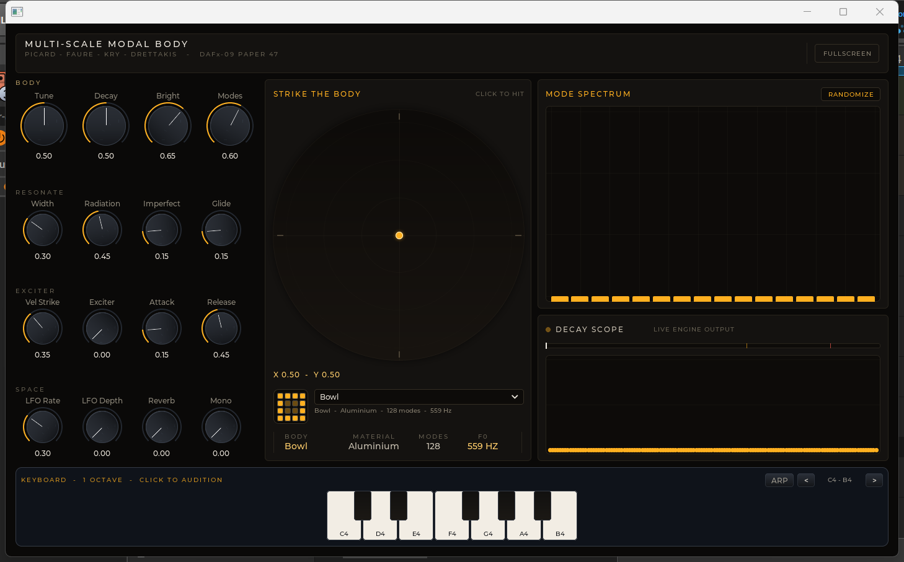

# MultiScaleBody

Struck-object modal resonator instrument. A physical body (bowl, plate, bell, gong, ...) is analysed offline into its modal set — frequencies, decays, and per-strike-position gains — and rendered in real time as a bank of reson filters driven by note-on impulses. Based on Picard, Faure, Kry & Drettakis, *A Robust and Multi-Scale Modal Analysis for Sound Synthesis* (DAFx-09, paper 47).



## Signal model

Each retained mode contributes one damped sinusoid:

$$s(t)=\sum_{i=1}^{n} a_i \sin(\omega_i t)\, e^{-d_i t}$$

where $\omega_i$ / $d_i$ are the baked modal frequencies/decays and $a_i$ is the Sound Map gain at the strike point. The plugin ships precomputed modal data (`ModalData.hpp`); the DSP is a per-mode biquad reson bank with strike-position gain interpolation — no runtime FEM.

## Formats

VST3 · CLAP · LV2 · JACK standalone (DPF), with an LVGL-based UI.

## Features

- **12 baked bodies**: Bowl, WoodBlock, Plate, Squirrel, Blade, Shell, Bar, Membrane, Bell, Glass, Chime, Gong — up to 128 modes each
- **Playable strike disc**: click sets strike position (X/Y) and triggers a hit; onset-triggered ripple rings
- **Tone shaping**: tune, decay, brightness, stereo width
- **Exciter**: exciter mix, velocity-to-strike, detune spread, glide, mono mode, LFO (rate/depth)
- **Space**: radiation mix, 16-band output EQ trims, wet/dry
- **Live visuals**: 16-band spectrum, decay scope, mode spectrum chart, on-screen keyboard

## Building

Requires CMake + Ninja and DPF/LVGL under `deps/` (see `BUILD.md`):

```sh
cmake -S . -B build -G Ninja
cmake --build build --target MultiScaleBody-vst3 MultiScaleBody-clap MultiScaleBody-lv2 MultiScaleBody-jack
```

Artifacts land in `build/bin/`.

## Rebaking modal data

`plugins/MultiScaleBody/src/ModalData.hpp` is committed; CMake never regenerates it. To rebake after changing `tools/modal_bake.py`:

```sh
python tools/modal_bake.py -o plugins/MultiScaleBody/src/ModalData.hpp   # needs numpy + scipy
```

## Tests

Two standalone tests, run by hand (see `BUILD.md`):

```sh
g++ -std=c++17 -I plugins/MultiScaleBody/src tests/test_modal_dsp.cpp plugins/MultiScaleBody/src/MultiScaleBodyEngine.cpp plugins/MultiScaleBody/src/OutputLP.cpp -o build/test_modal_dsp.exe && build/test_modal_dsp.exe
g++ -std=c++17 -O1 -DHOST_BINARY -I plugins/MultiScaleBody/src -I deps/DPF/distrho -I deps/DPF/dgl tests/test_preset_regression.cpp build/libMultiScaleBody-dsp.a deps/DPF/distrho/src/DistrhoPlugin.cpp deps/DPF/distrho/src/DistrhoUtils.cpp -DDISTRHO_IS_STANDALONE -o build/test_preset_regression.exe && build/test_preset_regression.exe
```

## References

- C. Picard, F. Faure, P. G. Kry, G. Drettakis, *A Robust and Multi-Scale Modal Analysis for Sound Synthesis*, DAFx-09 — local transcript: [`paper_47.md`](paper_47.md)
- K. van den Doel, P. G. Kry, D. K. Pai, *FoleyAutomatic*, SIGGRAPH 2001 (reson-filter rendering)
- Implementation notes: [`PLAN.md`](PLAN.md) · [`research-plan.md`](research-plan.md) · [`BUILD.md`](BUILD.md)

## License

MIT (see `getLicense()` in `plugins/MultiScaleBody/src/PluginMultiScaleBody.cpp`).
